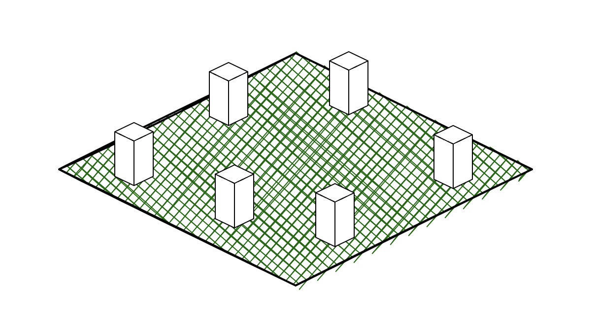
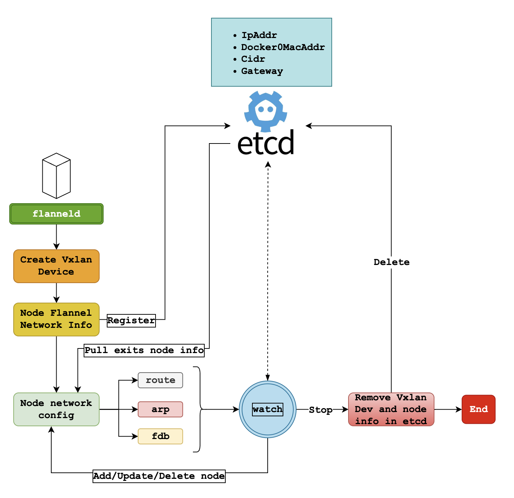
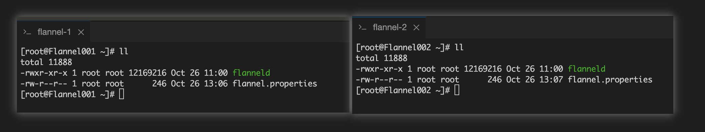
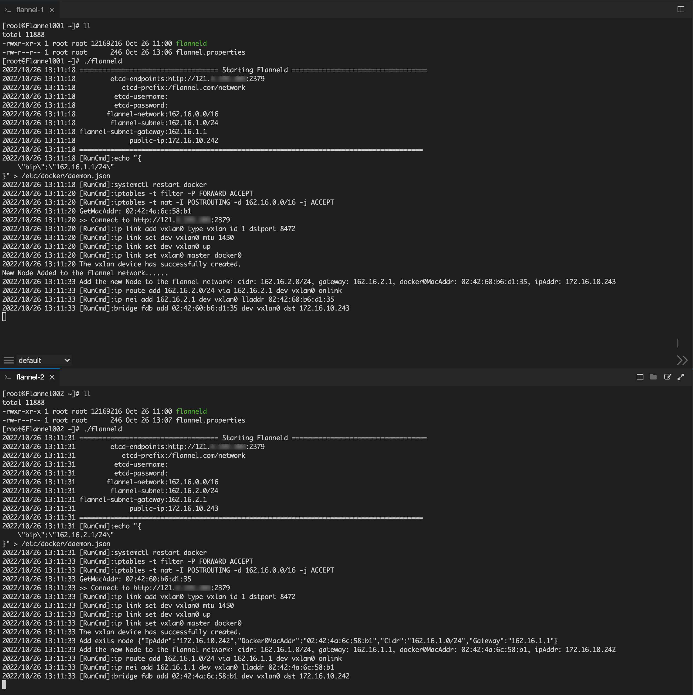
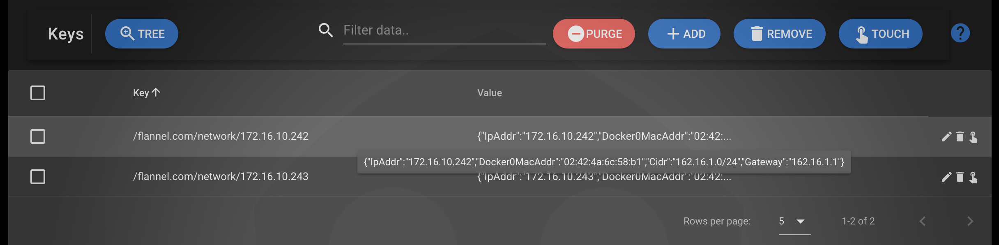
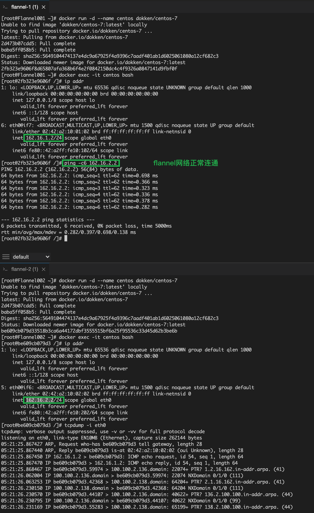

# 基于VxLAN的 Flanneld Go 简单实现

> 之前有手动配置过基于vxlan的flannel网络，最开始也是对k8s里面跨节点pod通信的好奇，在了解了一点皮毛的知识之后，想着自己也来
> 搞一个小玩具玩玩，用Go写了一个flanneld程序，于是就有了这篇文章。。。。

## 什么是Flannel扁平网络？

扁平网络，简而言之，就是一个虚拟的局域网。处于这个虚拟局域网中的节点可以直接使用虚拟的网络ip地址直接通信。



上图展示的就是一个大致示意，网络是一个虚拟出来的，可以虚拟出很多网络，图中的6个节点可以不断堆叠不同的扁平网络。

## 整体设计

由于之前做过相关的实验，采用vxlan虚拟网络设备，这次仍然基于此设计，设计比较简单，大佬忽略(^-^)



`flanneld`程序启动之后，会先在本地的机器上创建一个vxlan虚拟设备用于构建overlay网络，之后会将该节点的网络信息封装并注册到etcd数据库
中，用于被其他节点发现。在这之后，会从`etcd`数据库中拉取已经注册了的网络节点信息，并对`route/arp/fdb`表进行配置。到这一步，当前节点就算
接入到`flannel`网络中了，最后程序会进入监听状态，利用`etcd`的`watch`机制，观察网络节点的变化，一有变化，便会更新本地的网络配置。

## 实验验证

flanneld程序会从配置文件中读取启动的必要参数。

```properties
etcd-endpoint=http://121.xx.xx.xx:2379
etcd-prefix=/flannel.com/network
etcd-username=
etcd-password=
docker-net=162.16.3.1/24
flannel-network=162.16.0.0/16
flannel-subnet=162.16.3.0/24
flannel-subnet-gateway=162.16.3.1
public-ip=172.17.16.13

```
这里，我准备了两个机器。Flannel001和Flannel002.并将flanneld以及对应的配置文件准备好。



### 启动flanneld

先启动Flannel001，然后再启动Flannel002。

**终端输出**



Flannel001启动之后，会将自己注册到etcd中，Flannel002启动之后，可以看到Flannel001和Flannel002都从etcd中得到了网络节点的信息，
并配置本地的网络。

**ETCD数据库数据**



**启动容器验证网络**

为验证网络是否连通，使用`docker`启动一个`dokken/centos-7`容器.



很显然，flannel网络已经能正常连通工作了！


-----
```shell
[root@Flannel001 ~]# ll
total 11888
-rwxr-xr-x 1 root root 12169216 Oct 26 11:00 flanneld
-rw-r--r-- 1 root root      246 Oct 26 13:06 flannel.properties
[root@Flannel001 ~]# ./flanneld 
2022/10/26 13:11:18 ==================================== Starting Flanneld ===================================
2022/10/26 13:11:18         etcd-endpoints:http://121.4.195.203:2379
2022/10/26 13:11:18            etcd-prefix:/flannel.com/network
2022/10/26 13:11:18          etcd-username:
2022/10/26 13:11:18          etcd-password:
2022/10/26 13:11:18        flannel-network:162.16.0.0/16
2022/10/26 13:11:18         flannel-subnet:162.16.1.0/24
2022/10/26 13:11:18 flannel-subnet-gateway:162.16.1.1
2022/10/26 13:11:18              public-ip:172.16.10.242
2022/10/26 13:11:18 =========================================================================================
2022/10/26 13:11:18 [RunCmd]:echo "{
    \"bip\":\"162.16.1.1/24\"
}" > /etc/docker/daemon.json
2022/10/26 13:11:18 [RunCmd]:systemctl restart docker
2022/10/26 13:11:20 [RunCmd]:iptables -t filter -P FORWARD ACCEPT
2022/10/26 13:11:20 [RunCmd]:iptables -t nat -I POSTROUTING -d 162.16.0.0/16 -j ACCEPT
2022/10/26 13:11:20 GetMacAddr: 02:42:4a:6c:58:b1
2022/10/26 13:11:20 >> Connect to http://121.4.195.203:2379
2022/10/26 13:11:20 [RunCmd]:ip link add vxlan0 type vxlan id 1 dstport 8472
2022/10/26 13:11:20 [RunCmd]:ip link set dev vxlan0 mtu 1450
2022/10/26 13:11:20 [RunCmd]:ip link set dev vxlan0 up
2022/10/26 13:11:20 [RunCmd]:ip link set vxlan0 master docker0
2022/10/26 13:11:20 The vxlan device has successfully created.
New Node Added to the flannel network......
2022/10/26 13:11:33 Add the new Node to the flannel network：cidr: 162.16.2.0/24, gateway: 162.16.2.1, docker0MacAddr: 02:42:60:b6:d1:35, ipAddr: 172.16.10.243
2022/10/26 13:11:33 [RunCmd]:ip route add 162.16.2.0/24 via 162.16.2.1 dev vxlan0 onlink
2022/10/26 13:11:33 [RunCmd]:ip nei add 162.16.2.1 dev vxlan0 lladdr 02:42:60:b6:d1:35
2022/10/26 13:11:33 [RunCmd]:bridge fdb add 02:42:60:b6:d1:35 dev vxlan0 dst 172.16.10.243


[root@Flannel001 ~]# docker run -d --name centos dokken/centos-7
Unable to find image 'dokken/centos-7:latest' locally
Trying to pull repository docker.io/dokken/centos-7 ... 
latest: Pulling from docker.io/dokken/centos-7
2d473b07cdd5: Pull complete 
baba5ff058b5: Pull complete 
Digest: sha256:5649104474137e4dc9a67925f4a9396c7aadf401ab1d6025061080a12cf682c3
Status: Downloaded newer image for docker.io/dokken/centos-7:latest
2fb323e9606f8d65807afa368b6f4e2f0842150dc4c4f9326a0847141d9fbf0f
[root@Flannel001 ~]# docker exec -it centos bash
[root@2fb323e9606f /]# ip addr
1: lo: <LOOPBACK,UP,LOWER_UP> mtu 65536 qdisc noqueue state UNKNOWN group default qlen 1000
    link/loopback 00:00:00:00:00:00 brd 00:00:00:00:00:00
    inet 127.0.0.1/8 scope host lo
       valid_lft forever preferred_lft forever
    inet6 ::1/128 scope host 
       valid_lft forever preferred_lft forever
6: eth0@if7: <BROADCAST,MULTICAST,UP,LOWER_UP> mtu 1500 qdisc noqueue state UP group default 
    link/ether 02:42:a2:10:01:02 brd ff:ff:ff:ff:ff:ff link-netnsid 0
    inet 162.16.1.2/24 scope global eth0
       valid_lft forever preferred_lft forever
    inet6 fe80::42:a2ff:fe10:102/64 scope link 
       valid_lft forever preferred_lft forever
[root@2fb323e9606f /]# ping -c6 162.16.2.2
PING 162.16.2.2 (162.16.2.2) 56(84) bytes of data.
64 bytes from 162.16.2.2: icmp_seq=1 ttl=62 time=0.698 ms
64 bytes from 162.16.2.2: icmp_seq=2 ttl=62 time=0.366 ms
64 bytes from 162.16.2.2: icmp_seq=3 ttl=62 time=0.323 ms
64 bytes from 162.16.2.2: icmp_seq=4 ttl=62 time=0.336 ms
64 bytes from 162.16.2.2: icmp_seq=5 ttl=62 time=0.378 ms
64 bytes from 162.16.2.2: icmp_seq=6 ttl=62 time=0.282 ms

--- 162.16.2.2 ping statistics ---
6 packets transmitted, 6 received, 0% packet loss, time 5000ms
rtt min/avg/max/mdev = 0.282/0.397/0.698/0.138 ms
[root@2fb323e9606f /]# 

```

```shell
[root@Flannel002 ~]# ll
total 11888
-rwxr-xr-x 1 root root 12169216 Oct 26 11:00 flanneld
-rw-r--r-- 1 root root      246 Oct 26 13:07 flannel.properties
[root@Flannel002 ~]# ./flanneld 
2022/10/26 13:11:31 ==================================== Starting Flanneld ===================================
2022/10/26 13:11:31         etcd-endpoints:http://121.4.195.203:2379
2022/10/26 13:11:31            etcd-prefix:/flannel.com/network
2022/10/26 13:11:31          etcd-username:
2022/10/26 13:11:31          etcd-password:
2022/10/26 13:11:31        flannel-network:162.16.0.0/16
2022/10/26 13:11:31         flannel-subnet:162.16.2.0/24
2022/10/26 13:11:31 flannel-subnet-gateway:162.16.2.1
2022/10/26 13:11:31              public-ip:172.16.10.243
2022/10/26 13:11:31 =========================================================================================
2022/10/26 13:11:31 [RunCmd]:echo "{
    \"bip\":\"162.16.2.1/24\"
}" > /etc/docker/daemon.json
2022/10/26 13:11:31 [RunCmd]:systemctl restart docker
2022/10/26 13:11:33 [RunCmd]:iptables -t filter -P FORWARD ACCEPT
2022/10/26 13:11:33 [RunCmd]:iptables -t nat -I POSTROUTING -d 162.16.0.0/16 -j ACCEPT
2022/10/26 13:11:33 GetMacAddr: 02:42:60:b6:d1:35
2022/10/26 13:11:33 >> Connect to http://121.4.195.203:2379
2022/10/26 13:11:33 [RunCmd]:ip link add vxlan0 type vxlan id 1 dstport 8472
2022/10/26 13:11:33 [RunCmd]:ip link set dev vxlan0 mtu 1450
2022/10/26 13:11:33 [RunCmd]:ip link set dev vxlan0 up
2022/10/26 13:11:33 [RunCmd]:ip link set vxlan0 master docker0
2022/10/26 13:11:33 The vxlan device has successfully created.
2022/10/26 13:11:33 Add exits node {"IpAddr":"172.16.10.242","Docker0MacAddr":"02:42:4a:6c:58:b1","Cidr":"162.16.1.0/24","Gateway":"162.16.1.1"}
2022/10/26 13:11:33 Add the new Node to the flannel network：cidr: 162.16.1.0/24, gateway: 162.16.1.1, docker0MacAddr: 02:42:4a:6c:58:b1, ipAddr: 172.16.10.242
2022/10/26 13:11:33 [RunCmd]:ip route add 162.16.1.0/24 via 162.16.1.1 dev vxlan0 onlink
2022/10/26 13:11:33 [RunCmd]:ip nei add 162.16.1.1 dev vxlan0 lladdr 02:42:4a:6c:58:b1
2022/10/26 13:11:33 [RunCmd]:bridge fdb add 02:42:4a:6c:58:b1 dev vxlan0 dst 172.16.10.242


[root@Flannel002 ~]# docker run -d --name centos dokken/centos-7
Unable to find image 'dokken/centos-7:latest' locally
Trying to pull repository docker.io/dokken/centos-7 ... 
latest: Pulling from docker.io/dokken/centos-7
2d473b07cdd5: Pull complete 
baba5ff058b5: Pull complete 
Digest: sha256:5649104474137e4dc9a67925f4a9396c7aadf401ab1d6025061080a12cf682c3
Status: Downloaded newer image for docker.io/dokken/centos-7:latest
be609cb079d33518b3ca6a44172dbf3555515bf6a25f95536c33d45d62b3be6b
[root@Flannel002 ~]# docker exec -it centos bash
[root@be609cb079d3 /]# ip addr
1: lo: <LOOPBACK,UP,LOWER_UP> mtu 65536 qdisc noqueue state UNKNOWN group default qlen 1000
    link/loopback 00:00:00:00:00:00 brd 00:00:00:00:00:00
    inet 127.0.0.1/8 scope host lo
       valid_lft forever preferred_lft forever
    inet6 ::1/128 scope host 
       valid_lft forever preferred_lft forever
5: eth0@if6: <BROADCAST,MULTICAST,UP,LOWER_UP> mtu 1500 qdisc noqueue state UP group default 
    link/ether 02:42:a2:10:02:02 brd ff:ff:ff:ff:ff:ff link-netnsid 0
    inet 162.16.2.2/24 scope global eth0
       valid_lft forever preferred_lft forever
    inet6 fe80::42:a2ff:fe10:202/64 scope link 
       valid_lft forever preferred_lft forever
[root@be609cb079d3 /]# tcpdump -i eth0
tcpdump: verbose output suppressed, use -v or -vv for full protocol decode
listening on eth0, link-type EN10MB (Ethernet), capture size 262144 bytes
05:21:25.867427 ARP, Request who-has be609cb079d3 tell gateway, length 28
05:21:25.867440 ARP, Reply be609cb079d3 is-at 02:42:a2:10:02:02 (oui Unknown), length 28
05:21:25.867450 IP 162.16.1.2 > be609cb079d3: ICMP echo request, id 54, seq 1, length 64
05:21:25.867470 IP be609cb079d3 > 162.16.1.2: ICMP echo reply, id 54, seq 1, length 64
05:21:25.868467 IP be609cb079d3.59974 > 100.100.2.136.domain: 22074+ PTR? 1.2.16.162.in-addr.arpa. (41)
05:21:26.062004 IP 100.100.2.136.domain > be609cb079d3.59974: 22074 NXDomain 0/1/0 (111)
05:21:26.063253 IP be609cb079d3.42368 > 100.100.2.138.domain: 64204+ PTR? 2.1.16.162.in-addr.arpa. (41)
05:21:26.230150 IP 100.100.2.138.domain > be609cb079d3.42368: 64204 NXDomain 0/1/0 (111)
05:21:26.230570 IP be609cb079d3.44107 > 100.100.2.136.domain: 40622+ PTR? 136.2.100.100.in-addr.arpa. (44)
05:21:26.230795 IP 100.100.2.136.domain > be609cb079d3.44107: 40622 NXDomain 0/1/0 (99)
05:21:26.231169 IP be609cb079d3.55283 > 100.100.2.138.domain: 65199+ PTR? 138.2.100.100.in-addr.arpa. (44)
05:21:26.231385 IP 100.100.2.138.domain > be609cb079d3.55283: 65199 NXDomain 0/1/0 (99)
05:21:26.867321 IP 162.16.1.2 > be609cb079d3: ICMP echo request, id 54, seq 2, length 64
05:21:26.867352 IP be609cb079d3 > 162.16.1.2: ICMP echo reply, id 54, seq 2, length 64
05:21:27.867298 IP 162.16.1.2 > be609cb079d3: ICMP echo request, id 54, seq 3, length 64
05:21:27.867318 IP be609cb079d3 > 162.16.1.2: ICMP echo reply, id 54, seq 3, length 64
05:21:28.867304 IP 162.16.1.2 > be609cb079d3: ICMP echo request, id 54, seq 4, length 64
05:21:28.867324 IP be609cb079d3 > 162.16.1.2: ICMP echo reply, id 54, seq 4, length 64
05:21:29.867330 IP 162.16.1.2 > be609cb079d3: ICMP echo request, id 54, seq 5, length 64
05:21:29.867349 IP be609cb079d3 > 162.16.1.2: ICMP echo reply, id 54, seq 5, length 64
05:21:30.867296 IP 162.16.1.2 > be609cb079d3: ICMP echo request, id 54, seq 6, length 64
05:21:30.867316 IP be609cb079d3 > 162.16.1.2: ICMP echo reply, id 54, seq 6, length 64
05:21:30.871563 ARP, Request who-has gateway tell be609cb079d3, length 28
05:21:30.871580 ARP, Reply gateway is-at 02:42:60:b6:d1:35 (oui Unknown), length 28

```

