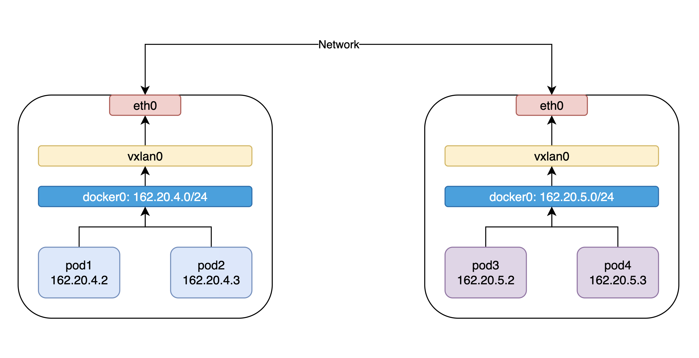
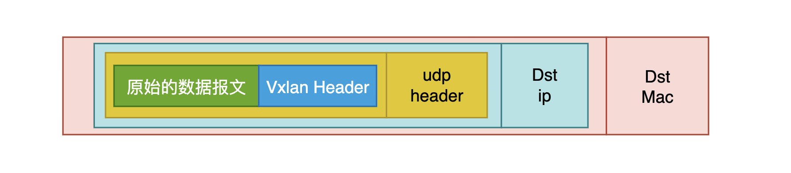
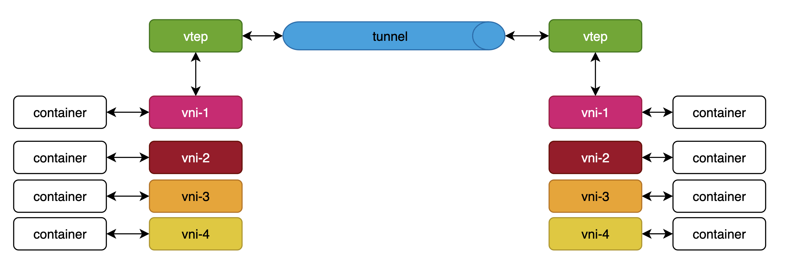

# VXLAN配置flannel网络

近段时间对k8s的网络有了一定的兴趣，于是对其扁平网络（flannel）进行了一点小的探索，在此记录一下。

## 跨节点的pod通信

跨节点的pod通信，k8s中采用的是flannel网络，采用了Linux的vxlan这个虚拟网络设备，
在二层网络上构建一个虚拟的局域网，各个pod通过这个虚拟出来的 二层overlay网络，即可完成通信。



## vxlan

Linux 对 VXLAN 协议的支持时间并不久，2012 年 Stephen Hemminger 
才把相关的工作合并到 kernel 中， 并最终出现在 kernel 3.7.0 版本。
为了稳定性和很多的功能，可能会看到某些软件推荐在 3.9.0 或者 3.10.0 以后版本的 kernel 
上使用 VXLAN。 到了 kernel 3.12 版本，Linux 对 VXLAN 的支持已经完备，支持单播和组播，
IPv4 和 IPv6。利用 man 查看 ip 的 link 子命令，可以查看是否有 VXLAN type：

```shell
man ip-link
```
vxlan的实现很简单：



它其实就是在做网络包的重新封包解包操作，vxlan将原始的数据报文加上vxlan_header（包含vxlan设备信息）
以便于对端的vxlan设备能够正确地区分接收数据报文，然后就包装udp数据报文，并且在udp数据报文重新按照配置好的路由表，arp表
fdb表，封装二层网络数据包，通过网卡发送出去；当数据包到达对端之后，逐层解包，将数据呈递对应的设备即可完成通信。


### tunnel

tunnel隧道，在这里，这就是一个虚拟的概念，不同机器上的vxlan设备通过这个虚拟的隧道可以直接地通信。

### vni

vni(vxlan network identifier),实际上就一个用来区分不同vxlan虚拟设备的id号，vxlan允许用户在一个机器上创建多个
vxlan虚拟网络设备，进而可以支持用户创建多个互不影响的overlay网络。

### vtep

vtep(vxlan tunnel endpoints), 意思就是vxlan隧道断点，每个节点中会创建一个vxlan虚拟网络设备，来获取其对应的隧道
的数据包。



上图表示来vxlan的主要工作方式，每个节点会有一个vtep，其会从隧道中得到vxlan数据包，以及往隧道中
发送vxlan数据包，它会按照vxlan协议封包解包。

## flannel网络配置

按照上面的思路，想要两个节点通过隧道通信，需要在不同的节点上创建vxlan虚拟网络设备，并把它们启动起来。

```shell
# create vxlan device
ip link add vxlan0 type vxlan id 1 dstport 8472
ip link set dev vxlan0 up
```

参数说明：
 - `id`: vni
 - `dsport`： udp监听的端口号

这里，使用docker默认的网桥docker0设备作为下面容器的访问网关，使其作为vxlan0的master, 连接起来.

```shell
# connect vxlan0 to docker0 bridge
ip link set vxlan0 master docker0
```

接下来，需要配置路由表，例如，`pod1(162.20.4.2)`想要访问`pod3(162.20.5.2)`, 可以在pod1的机器上进行如下路由设置：

```shell
ip route add 162.20.5.0/24 via 162.20.5.1 dev vxlan0 onlink
```

说明：

这个路由配置表示访问网段：`162.20.5.0/24`的请求会通过`162.20.5.1`这个网关， 由设备`vxlan0`处理，而`onlink`则表示
告诉Linux你不需要去探测`162.20.5.1`在本地是否存在，直接添加到路由表即可。

因为vxlan是一个二层网络虚拟设备，它会去询问`162.20.5.1`的mac地址是啥（arp协议），很显然，这个ip在本地机器上根本不存在，
这是需要我们自己来配置arp表，很直白地告诉vxlan。这里我们选择对端机器的`docker0_mac_addr`作为mac地址。

```shell
ip nei add 162.20.5.1 dev vxlan0 lladdr ${docker0_mac_addr}
```

这样，就可以得到发送到`162.20.5.1`的数据包的目标mac地址了，但是这个请求最终往外发送，还需要知道这个mac地址到底是在那个机器上的，
因此还需要配置fdb表，来告诉它。

```shell
bridge fdb add ${docker0_mac_addr} dev vxlan0 dst ${target_ip}
```

以上操作在两个机器都做好配置之后，理论上网络就可以通了。但是在实际实验中发现网络并不通。原因是防火墙的原因，forward drop，所以使用
iptables设置其为accept.

```shell
iptables -t filter -P FORWARD ACCEPT
```

设置之后，仍然不通，发现是docker生成网络的配置问题，有一个`-A POSTROUTING -s 162.20.5.0/24 ! -o docker0 -j MASQUERADE`规则
会用实际的ip去伪装数据的源ip，如此以来，数据包可以正常地到达对端的容器里面，但是没有返回数据包。因此做以下配置：

```shell
iptables -t nat -I POSTROUTING -d ${flannel_subnet} -j ACCEPT
```

最后，给予vxlan的一个简单的overlay网络就配置完成了。

整体的脚本：

```shell
node1:172.16.10.245
#!/bin/bash
docker0_mac_addr="02:42:c4:1a:6e:67"
flannel_subnet="162.20.0.0/16"

# create vxlan device
ip link add vxlan0 type vxlan id 1 dstport 8472
# up the vxlan device
ip link set dev vxlan0 up
# connect vxlan0 to docker0 bridge
ip link set vxlan0 master docker0

# add other node sub net to vxlan0
#ip route add 162.20.4.0/24 dev vxlan0
ip route add 162.20.4.0/24 via 162.20.4.1 dev vxlan0 onlink
ip nei add 162.20.4.1 dev vxlan0 lladdr ${docker0_mac_addr}

bridge fdb add ${docker0_mac_addr} dev vxlan0 dst 172.16.10.244

iptables -t filter -P FORWARD ACCEPT
iptables -t nat -I POSTROUTING -d ${flannel_subnet} -j ACCEPT


node2:172.16.10.244
#!/bin/bash
docker0_mac_addr="02:42:d4:11:83:01"
flannel_subnet="162.20.0.0/16"

# create vxlan device
ip link add vxlan0 type vxlan id 1 dstport 8472
# up the vxlan device
ip link set dev vxlan0 up
# connect vxlan0 to docker0 bridge
ip link set vxlan0 master docker0

# add other node sub net to vxlan0
#ip route add 162.20.4.0/24 dev vxlan0
ip route add 162.20.5.0/24 via 162.20.5.1 dev vxlan0 onlink
ip nei add 162.20.5.1 dev vxlan0 lladdr ${docker0_mac_addr}

bridge fdb add ${docker0_mac_addr} dev vxlan0 dst 172.16.10.245

iptables -t filter -P FORWARD ACCEPT
iptables -t nat -I POSTROUTING -d ${flannel_subnet} -j ACCEPT
```

实验效果：

`node2:172.16.10.244`
```shell
[root@8fee2cecb88e /]# ifconfig
eth0: flags=4163<UP,BROADCAST,RUNNING,MULTICAST>  mtu 1500
        inet 162.20.4.2  netmask 255.255.255.0  broadcast 0.0.0.0
        inet6 fe80::42:a2ff:fe14:402  prefixlen 64  scopeid 0x20<link>
        ether 02:42:a2:14:04:02  txqueuelen 0  (Ethernet)
        RX packets 89  bytes 8629 (8.4 KiB)
        RX errors 0  dropped 0  overruns 0  frame 0
        TX packets 77  bytes 6406 (6.2 KiB)
        TX errors 0  dropped 0 overruns 0  carrier 0  collisions 0

lo: flags=73<UP,LOOPBACK,RUNNING>  mtu 65536
        inet 127.0.0.1  netmask 255.0.0.0
        inet6 ::1  prefixlen 128  scopeid 0x10<host>
        loop  txqueuelen 1000  (Local Loopback)
        RX packets 0  bytes 0 (0.0 B)
        RX errors 0  dropped 0  overruns 0  frame 0
        TX packets 0  bytes 0 (0.0 B)
        TX errors 0  dropped 0 overruns 0  carrier 0  collisions 0

[root@8fee2cecb88e /]# ping -c5 162.20.5.2
PING 162.20.5.2 (162.20.5.2) 56(84) bytes of data.
64 bytes from 162.20.5.2: icmp_seq=1 ttl=62 time=0.487 ms
64 bytes from 162.20.5.2: icmp_seq=2 ttl=62 time=0.350 ms
64 bytes from 162.20.5.2: icmp_seq=3 ttl=62 time=0.344 ms
64 bytes from 162.20.5.2: icmp_seq=4 ttl=62 time=0.337 ms
64 bytes from 162.20.5.2: icmp_seq=5 ttl=62 time=0.322 ms

--- 162.20.5.2 ping statistics ---
5 packets transmitted, 5 received, 0% packet loss, time 3999ms
rtt min/avg/max/mdev = 0.322/0.368/0.487/0.060 ms
[root@8fee2cecb88e /]# 
```

`node2:172.16.10.245`

```shell
[root@7c1773e591bb /]# ifconfig
eth0: flags=4163<UP,BROADCAST,RUNNING,MULTICAST>  mtu 1500
        inet 162.20.5.2  netmask 255.255.255.0  broadcast 0.0.0.0
        inet6 fe80::42:a2ff:fe14:502  prefixlen 64  scopeid 0x20<link>
        ether 02:42:a2:14:05:02  txqueuelen 0  (Ethernet)
        RX packets 149  bytes 13784 (13.4 KiB)
        RX errors 0  dropped 0  overruns 0  frame 0
        TX packets 148  bytes 11982 (11.7 KiB)
        TX errors 0  dropped 0 overruns 0  carrier 0  collisions 0

lo: flags=73<UP,LOOPBACK,RUNNING>  mtu 65536
        inet 127.0.0.1  netmask 255.0.0.0
        inet6 ::1  prefixlen 128  scopeid 0x10<host>
        loop  txqueuelen 1000  (Local Loopback)
        RX packets 0  bytes 0 (0.0 B)
        RX errors 0  dropped 0  overruns 0  frame 0
        TX packets 0  bytes 0 (0.0 B)
        TX errors 0  dropped 0 overruns 0  carrier 0  collisions 0

[root@7c1773e591bb /]# tcpdump -i eth0
tcpdump: verbose output suppressed, use -v or -vv for full protocol decode
listening on eth0, link-type EN10MB (Ethernet), capture size 262144 bytes
03:33:27.997089 IP 162.20.4.2 > 7c1773e591bb: ICMP echo request, id 559, seq 1, length 64
03:33:27.997119 IP 7c1773e591bb > 162.20.4.2: ICMP echo reply, id 559, seq 1, length 64
03:33:27.999277 IP 7c1773e591bb.48724 > 100.100.2.136.domain: 27708+ PTR? 2.4.20.162.in-addr.arpa. (41)
03:33:28.165303 IP 100.100.2.136.domain > 7c1773e591bb.48724: 27708 NXDomain 0/1/0 (111)
03:33:28.167599 IP 7c1773e591bb.34407 > 100.100.2.138.domain: 25203+ PTR? 136.2.100.100.in-addr.arpa. (44)
03:33:28.167774 IP 100.100.2.138.domain > 7c1773e591bb.34407: 25203 NXDomain 0/1/0 (99)
03:33:28.168102 IP 7c1773e591bb.35158 > 100.100.2.136.domain: 44102+ PTR? 138.2.100.100.in-addr.arpa. (44)
03:33:28.168325 IP 100.100.2.136.domain > 7c1773e591bb.35158: 44102 NXDomain 0/1/0 (99)
03:33:28.996810 IP 162.20.4.2 > 7c1773e591bb: ICMP echo request, id 559, seq 2, length 64
03:33:28.996833 IP 7c1773e591bb > 162.20.4.2: ICMP echo reply, id 559, seq 2, length 64
03:33:29.996799 IP 162.20.4.2 > 7c1773e591bb: ICMP echo request, id 559, seq 3, length 64
03:33:29.996831 IP 7c1773e591bb > 162.20.4.2: ICMP echo reply, id 559, seq 3, length 64
03:33:30.996800 IP 162.20.4.2 > 7c1773e591bb: ICMP echo request, id 559, seq 4, length 64
03:33:30.996823 IP 7c1773e591bb > 162.20.4.2: ICMP echo reply, id 559, seq 4, length 64
03:33:31.996825 IP 162.20.4.2 > 7c1773e591bb: ICMP echo request, id 559, seq 5, length 64
03:33:31.996844 IP 7c1773e591bb > 162.20.4.2: ICMP echo reply, id 559, seq 5, length 64
03:33:33.012238 ARP, Request who-has gateway tell 7c1773e591bb, length 28
03:33:33.012235 ARP, Request who-has 7c1773e591bb tell gateway, length 28
03:33:33.012261 ARP, Reply 7c1773e591bb is-at 02:42:a2:14:05:02 (oui Unknown), length 28
03:33:33.012268 ARP, Reply gateway is-at 02:42:d4:11:83:01 (oui Unknown), length 28
03:33:33.012455 IP 7c1773e591bb.43685 > 100.100.2.138.domain: 22020+ PTR? 1.5.20.162.in-addr.arpa. (41)
03:33:33.213754 IP 100.100.2.138.domain > 7c1773e591bb.43685: 22020 NXDomain 0/1/0 (111)

```


